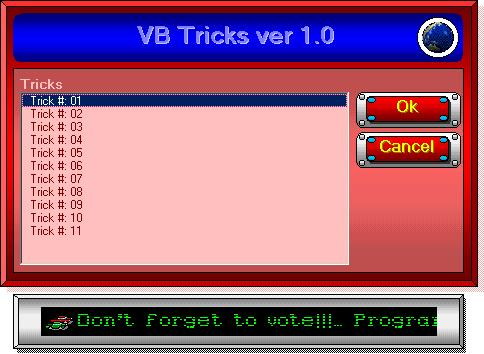

## Visual Basic Tricks

### Description

just look at my tricks, i think it will help you a lot. Next time, i will make more. If you have any comments or suggestions, you can email at AJB2001LG@YAHOO.COM
 
### More Info
 

             |
---                |---
**Submitted On**   |2002-02-02 15:21:26
**By**             |[Justice League](https://github.com/Planet-Source-Code/PSCIndex/blob/master/ByAuthor/justice-league.md)
**Level**          |Advanced
**User Rating**    |4.7 (75 globes from 16 users)
**Compatibility**  |VB 5\.0, VB 6\.0
**Category**       |[Coding Standards](https://github.com/Planet-Source-Code/PSCIndex/blob/master/ByCategory/coding-standards__1-43.md)
**World**          |[Visual Basic](https://github.com/Planet-Source-Code/PSCIndex/blob/master/ByWorld/visual-basic.md)
**Archive File**   |[Visual\_Bas52585232002\.zip](https://github.com/Planet-Source-Code/justice-league-visual-basic-tricks__1-31446/archive/master.zip)

